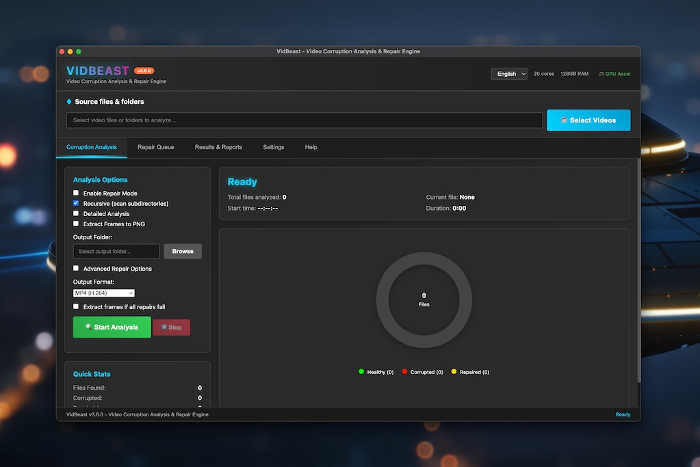

# VidBeast v3.5

## 📸 Application Interface



## Overview
VidBeast is an advanced video corruption analysis and repair engine with FFmpeg integration. Built as a cross-platform Electron desktop application, VidBeast provides professional-grade tools for video processing, corruption detection, and automated repair workflows.

## Tech Stack
See [tech-stack.md](dev/tech-stack.md) for detailed technology information.

**Core Technologies:**
- **Framework**: Electron v38.1.0
- **Language**: JavaScript with TypeScript configuration
- **Video Processing**: FFmpeg integration with platform-specific binaries
- **Build System**: electron-builder with comprehensive multi-platform support

## Quick Start

### Prerequisites
- Node.js >=16.0.0
- npm >=8.0.0

### Installation
```bash
# Clone the repository
git clone https://github.com/vidbeast/vidbeast.git
cd vidbeast

# Install dependencies
npm install

# Build and run
./scripts/build-compile-dist.sh
```

### Running the Application

The build script creates platform-specific executables in the `dist/` directory:

- **macOS**: `VidBeast-*.dmg` or `VidBeast.app`
- **Windows**: `VidBeast Setup *.exe`
- **Linux**: `VidBeast-*.AppImage` or `VidBeast*.deb`

After building, install and run the application using the appropriate package for your platform.

## Project Structure

```
vidbeast/
├── src/                    # Source code
│   ├── main.js            # Electron main process
│   ├── renderer/          # Renderer process (UI)
│   ├── components/        # UI components
│   ├── services/          # Business logic
│   ├── lib/               # Core libraries
│   ├── utils/             # Utility functions
│   ├── types/             # TypeScript definitions
│   ├── constants/         # Application constants
│   └── styles/            # CSS stylesheets
├── build_resources/       # Build resources and assets
│   ├── binaries/         # FFmpeg binaries (per platform)
│   ├── icons/            # Platform-specific application icons
│   └── screenshots/      # Application screenshots
├── scripts/               # Build scripts
├── docs/                  # User documentation
├── archive/               # Archived files and resources
└── dist/                  # Build outputs (generated)
```

## Features

### Core Video Processing
- **Corruption Detection**: Advanced algorithms for identifying video file corruption
- **Automated Repair**: Intelligent repair workflows using FFmpeg
- **Batch Processing**: Handle multiple files simultaneously
- **Format Support**: Comprehensive video format compatibility

### Platform Support
- **macOS**: Intel, Apple Silicon, Universal builds
- **Windows**: x64, x86, ARM64 architectures  
- **Linux**: x64, ARM64, ARMv7l with multiple package formats

### Advanced Features
- **Real-time Analysis**: Live video corruption monitoring
- **Metadata Extraction**: Comprehensive video file information
- **Progress Tracking**: Visual feedback for long-running operations
- **Report Generation**: Detailed analysis and repair reports

## Build System

VidBeast includes a comprehensive build system supporting all major platforms and installer formats:

```bash
# Build for current platform (auto-detected)
./scripts/build-compile-dist.sh

# Build for specific platforms
./scripts/build-compile-dist.sh --platform mac
./scripts/build-compile-dist.sh --platform win
./scripts/build-compile-dist.sh --platform linux

# Quick development build
./scripts/build-compile-dist.sh --quick

# Build for all platforms
./scripts/build-compile-dist.sh --platform all
```

### Supported Package Formats
- **macOS**: DMG, PKG, ZIP, Universal builds
- **Windows**: NSIS, MSI, Portable, APPX, ZIP
- **Linux**: AppImage, DEB, RPM, Snap, TAR archives

## Documentation

- [Technical Architecture](docs/ARCHITECTURE.md)
- [Security](SECURITY.md)
- [License](LICENSE)

## Contributing

Contributions are welcome! Please feel free to submit pull requests or create issues for bug reports and feature requests.

## Security

For security concerns and vulnerability reports, see [SECURITY.md](SECURITY.md).

## License

This project is licensed under the MIT License - see the [LICENSE](LICENSE) file for details.

## Support

- **Issues**: Report bugs and feature requests via GitHub issues
- **Documentation**: Comprehensive guides in the `/docs` directory
- **Development**: Join development discussions and contribute code

---

**VidBeast v3.5** - Professional video corruption analysis and repair engine  
Built with ❤️ using Electron and FFmpeg