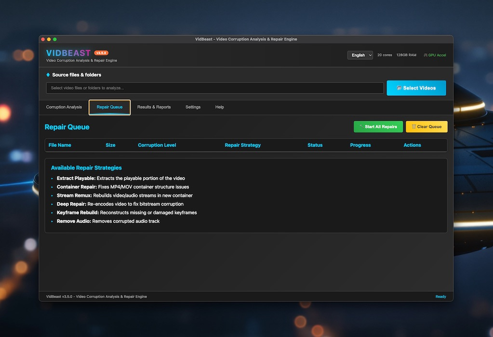

# VidBeast 🎬

> Advanced Video Corruption Analysis and Repair Engine


[](https://opensource.org/licenses/MIT)
[](https://www.electronjs.org/)
[](https://nodejs.org/)
[](https://github.com/vidbeast/vidbeast/releases)

## 📸 Application Interface


> The Professional Video Corruption Analysis and Repair Engine

VidBeast is an advanced video corruption analysis and repair engine with FFmpeg integration. Built as a cross-platform Electron desktop application, VidBeast provides professional-grade tools for video processing, corruption detection, and automated repair workflows.

## Tech Stack
See [tech-stack.md](dev/tech-stack.md) for detailed technology information.

**Core Technologies:**
- **Framework**: Electron v38.1.0
- **Language**: JavaScript with TypeScript configuration
- **Video Processing**: FFmpeg integration with platform-specific binaries
- **Build System**: electron-builder with comprehensive multi-platform support

## 📸 Screenshots

<details>
<summary>View Screenshots</summary>


*Main interface showing video analysis dashboard*


*Detailed corruption detection and analysis results*


*Real-time repair progress with detailed logging*

</details>

## 🚀 Quick Start - One-Command Build & Run

### Prerequisites
- **Node.js** 16+ and npm
- **FFmpeg** (automatically included with builds)

### Option 1: One-Command Solution (Recommended)

```bash
# Clone and build
git clone https://github.com/vidbeast/vidbeast.git
cd vidbeast

# Build and run with a single command!
./scripts/build-compile-dist.sh
```

### Option 2: Development Mode

```bash
# Run in development mode with hot reload
./scripts/build-compile-dist.sh --dev
```

### Build Options

```bash
# Build only (don't launch)
./scripts/build-compile-dist.sh --build-only

# Clean build
./scripts/build-compile-dist.sh --clean

# Build for specific platform
./scripts/build-compile-dist.sh --platform mac
./scripts/build-compile-dist.sh --platform win
./scripts/build-compile-dist.sh --platform linux

# Build for all platforms
./scripts/build-compile-dist.sh --platform all
```

### Running the Application

The build script creates platform-specific executables in the `dist/` directory:

- **macOS**: `VidBeast-*.dmg` or `VidBeast.app`
- **Windows**: `VidBeast Setup *.exe`
- **Linux**: `VidBeast-*.AppImage` or `VidBeast*.deb`

After building, install and run the application using the appropriate package for your platform.

## Project Structure

```
vidbeast/
├── src/                    # Source code
│   ├── main.js            # Electron main process
│   ├── renderer/          # Renderer process (UI)
│   ├── components/        # UI components
│   ├── services/          # Business logic
│   ├── lib/               # Core libraries
│   ├── utils/             # Utility functions
│   ├── types/             # TypeScript definitions
│   ├── constants/         # Application constants
│   └── styles/            # CSS stylesheets
├── build_resources/       # Build resources and assets
│   ├── binaries/         # FFmpeg binaries (per platform)
│   ├── icons/            # Platform-specific application icons
│   └── screenshots/      # Application screenshots
├── scripts/               # Build scripts
├── docs/                  # User documentation
├── archive/               # Archived files and resources
└── dist/                  # Build outputs (generated)
```

## ✨ Features

### Core Video Processing
- 🔍 **Advanced Corruption Detection** - State-of-the-art algorithms for identifying video file corruption
- 🛠️ **Intelligent Repair Workflows** - Automated repair processes using FFmpeg
- 📦 **Batch Processing** - Handle multiple files simultaneously with queue management
- 🎬 **Comprehensive Format Support** - Support for all major video formats and codecs

### Platform Support
- 🍎 **macOS** - Intel, Apple Silicon, Universal builds with code signing
- 🪟 **Windows** - x64, x86, ARM64 architectures with installer packages
- 🐧 **Linux** - x64, ARM64, ARMv7l with multiple package formats (AppImage, DEB, RPM)

### Advanced Features
- ⚡ **Real-time Analysis** - Live video corruption monitoring and detection
- 📊 **Metadata Extraction** - Comprehensive video file information and statistics
- 📈 **Progress Tracking** - Visual feedback for long-running operations
- 📋 **Report Generation** - Detailed analysis and repair reports with recommendations

## 📦 Build System

VidBeast includes a comprehensive build system supporting all major platforms and installer formats:

### Universal Build Script

The `build-compile-dist.sh` script automatically detects your platform and builds the appropriate package:

```bash
# Build for current platform (auto-detected)
./scripts/build-compile-dist.sh

# Build for specific platforms
./scripts/build-compile-dist.sh --platform mac
./scripts/build-compile-dist.sh --platform win
./scripts/build-compile-dist.sh --platform linux

# Quick development build
./scripts/build-compile-dist.sh --quick

# Build for all platforms
./scripts/build-compile-dist.sh --platform all
```

### Supported Package Formats

#### macOS
- **DMG**: Standard macOS disk image with拖拽安装
- **PKG**: macOS installer package for enterprise deployment
- **ZIP**: Universal binary archive
- **Universal**: Combined Intel + Apple Silicon builds

#### Windows
- **NSIS**: Nullsoft Scriptable Install System installer
- **MSI**: Windows Installer package for enterprise deployment
- **Portable**: Standalone executable without installation
- **APPX**: Windows Store package format
- **ZIP**: Archive version for manual extraction

#### Linux
- **AppImage**: Portable application that runs on most Linux distributions
- **DEB**: Debian/Ubuntu package format
- **RPM**: Red Hat/Fedora package format
- **Snap**: Universal Linux package format
- **TAR**: Archive for custom installations

## 🔧 Configuration

### Directory Structure

```
~/.vidbeast/
├── models/          # Temporary processing files
├── logs/            # Application logs
├── config.json      # User configuration
└── cache/           # Analysis cache
```

### Environment Variables

```bash
# Set custom temp directory
export VIDBEAST_TEMP_DIR=/path/to/temp

# Set custom log level
export VIDBEAST_LOG_LEVEL=debug

# Disable hardware acceleration
export VIDBEAST_NO_HW_ACCEL=1
```

## 🐛 Troubleshooting

### Common Issues

<details>
<summary>FFmpeg not found</summary>

VidBeast includes FFmpeg binaries, but if you encounter issues:
```bash
# macOS with Homebrew
brew install ffmpeg

# Ubuntu/Debian
sudo apt-get install ffmpeg

# Windows
# Download from https://ffmpeg.org/download.html
```
</details>

<details>
<summary>Video won't analyze</summary>

1. Check if the file format is supported
2. Ensure you have enough disk space (2x file size recommended)
3. Try restarting the application
4. Check logs in `~/.vidbeast/logs/`
</details>

<details>
<summary>Build fails on macOS</summary>

- Ensure Xcode Command Line Tools are installed: `xcode-select --install`
- Try cleaning the build directory: `rm -rf dist/`
- Use `--clean` flag with the build script
</details>

## Documentation

- [Technical Architecture](docs/ARCHITECTURE.md)
- [Security](SECURITY.md)
- [License](LICENSE)

## Contributing

Contributions are welcome! Please feel free to submit pull requests or create issues for bug reports and feature requests.

## Security

For security concerns and vulnerability reports, see [SECURITY.md](SECURITY.md).

## License

This project is licensed under the MIT License - see the [LICENSE](LICENSE) file for details.

## Support

- **Issues**: Report bugs and feature requests via GitHub issues
- **Documentation**: Comprehensive guides in the `/docs` directory
- **Development**: Join development discussions and contribute code

---

**VidBeast v3.5** - Professional video corruption analysis and repair engine
Built with AI!