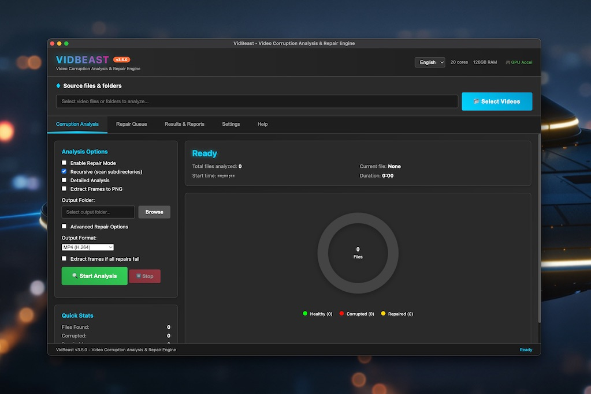
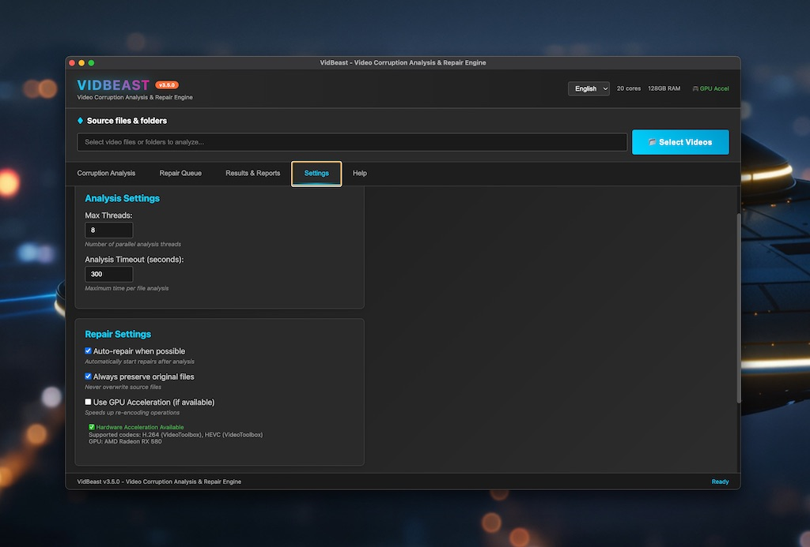
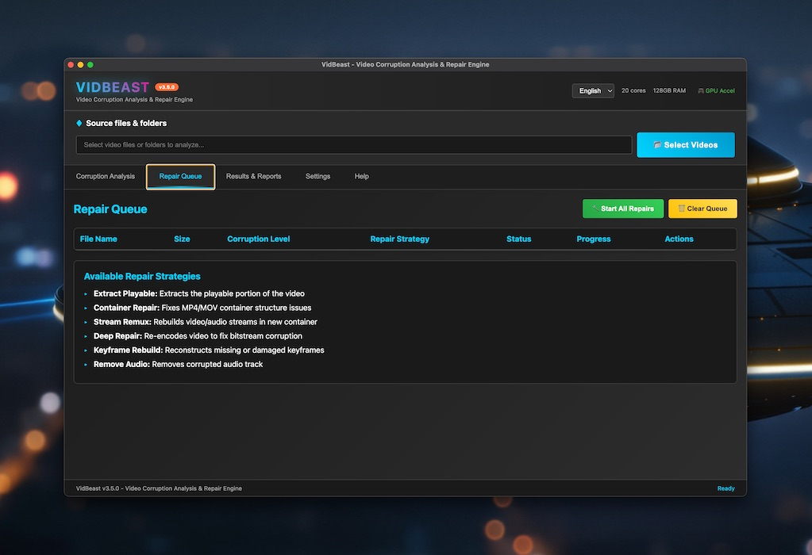

# VidBeast

**Video Corruption Analysis and Repair Engine**


[](https://opensource.org/licenses/MIT)
[](https://www.electronjs.org/)
[](https://nodejs.org/)
[](https://github.com/sanchez314c/vid-beast)

VidBeast is a cross-platform desktop app for finding and fixing corrupted video files. Drop a folder of videos into it, and it runs them through FFmpeg to detect container issues, broken streams, and playback failures. For the ones it can fix, it runs multiple repair strategies and shows you exactly what worked.

Built on Electron with a custom Neo-Noir glass UI. No server required, everything runs locally.

## Screenshots

<details>
<summary>View screenshots</summary>


*Main analysis dashboard*


*Corruption detection results*


*Real-time repair progress*

</details>

## Features

**Analysis**
- Scans individual files or entire folder trees recursively
- Six-phase analysis pipeline: container structure, stream integrity, bitstream errors, playability testing, and repairability scoring
- Classifies corruption into five severity levels (None, Minor, Moderate, Severe, Catastrophic)
- Extracts technical metadata via FFprobe

**Repair**
- Four repair strategies per file: playable portion extraction, container rebuild, stream remuxing, and audio repair/removal
- "Try all strategies" mode for badly damaged files
- Frame extraction to PNG as a fallback for unrepairables (0.1fps to 30fps)
- Configurable output format: MP4 H.264, MP4 HEVC, or Apple ProRes

**UI**
- Tabbed interface: Corruption Analysis, Repair Queue, Results and Reports, Settings, Help
- Real-time progress charts and per-file status updates
- Drag-and-drop file input
- Custom frameless window with Neo-Noir glass design

**Formats supported:** `.mp4`, `.mov`, `.avi`, `.mkv`, `.m4v`, `.flv`, `.webm`, `.wmv`, `.mpg`, `.mpeg`

## Tech Stack

| Component | Technology |
|---|---|
| Framework | Electron v38.1.0 |
| Runtime | Node.js v16+ |
| Video backend | FFmpeg v7+ / FFprobe |
| UI | HTML5, CSS3, vanilla JavaScript |
| Build | electron-builder v25.1.8 |
| Types | TypeScript v5.6.3 (config only) |

FFmpeg binaries for all platforms are bundled in `resources/binaries/`. The app falls back to your system FFmpeg if bundled ones aren't found.

## Quick Start

```bash
git clone https://github.com/sanchez314c/vid-beast.git
cd vid-beast
npm install
./run-source-linux.sh   # Linux
./run-source-macos.sh   # macOS
```

Or run directly with npm:

```bash
npm run dev
```

See [SETUP.md](SETUP.md) for detailed instructions, platform notes, and troubleshooting.

## Building

Build a distributable package:

```bash
# Current platform
npm run build

# Specific platform
npm run build:mac
npm run build:win
npm run build:linux

# All platforms
npm run build:all
```

Output goes to `dist/`. Supported package formats:
- **macOS**: DMG, PKG, ZIP, universal binary
- **Windows**: NSIS installer, MSI, portable EXE, APPX, ZIP
- **Linux**: AppImage, DEB, RPM, Snap, TAR

## Configuration

**App settings** (editable in the Settings tab or directly in `config/`):

```json
{
  "processing": {
    "maxConcurrentJobs": 2,
    "autoCleanup": true
  },
  "repair": {
    "defaultStrategy": "conservative",
    "createBackups": true,
    "verifyOutput": true
  }
}
```

**Environment variables:**

```bash
VIDBEAST_TEMP_DIR=/path/to/temp   # Override temp directory
VIDBEAST_LOG_LEVEL=debug          # Log verbosity
VIDBEAST_NO_HW_ACCEL=1            # Disable hardware acceleration
```

**Linux sandbox fix** (if Electron crashes on launch):
```bash
sudo sysctl -w kernel.unprivileged_userns_clone=1
```
The `run-source-linux.sh` script handles this automatically.

## Project Structure

```
vid-beast/
├── src/
│   ├── main.js             # Electron main process, FFmpeg orchestration
│   ├── renderer/           # Renderer process (HTML, CSS, JS)
│   │   ├── index.html
│   │   ├── renderer.js
│   │   ├── preload.js
│   │   └── styles.css
│   ├── components/         # UI components
│   ├── services/           # Business logic services
│   ├── lib/                # Core libraries
│   ├── utils/              # Utility functions
│   ├── types/              # TypeScript definitions
│   ├── constants/          # App constants
│   └── sources/            # Legacy/reference scripts
├── resources/
│   └── binaries/           # Bundled FFmpeg per platform
│       ├── darwin-arm64/
│       ├── darwin-x64/
│       ├── linux-x64/
│       └── win32-x64/
├── build_resources/
│   ├── icons/              # App icons (.icns, .ico, .png)
│   └── screenshots/        # App screenshots
├── scripts/                # Build and run scripts
├── config/                 # App config files
├── docs/                   # Extended documentation
├── tests/                  # Test files
├── legacy/                 # Archived scripts from v1
└── dist/                   # Build output (generated)
```

## Documentation

- [ARCHITECTURE.md](ARCHITECTURE.md) - System design and data flow
- [SETUP.md](SETUP.md) - Detailed setup guide
- [CHANGELOG.md](CHANGELOG.md) - Version history
- [SECURITY.md](SECURITY.md) - Security policy
- [docs/](docs/) - Extended documentation index

## License

MIT License. See [LICENSE](LICENSE) for details.
